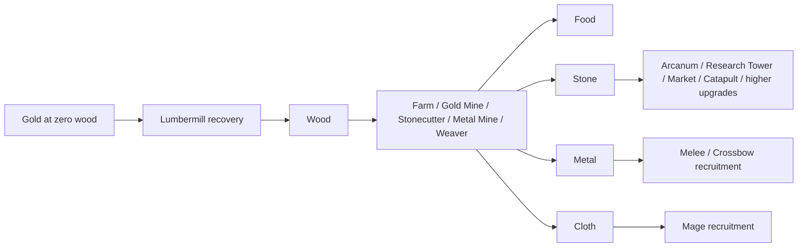
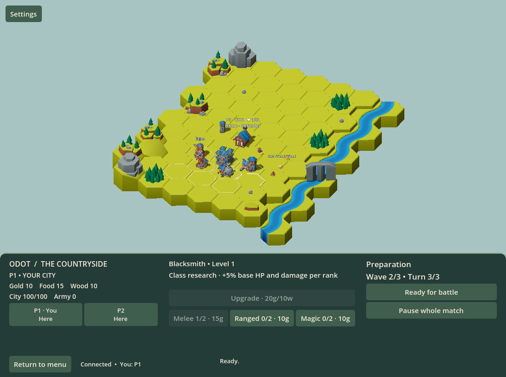
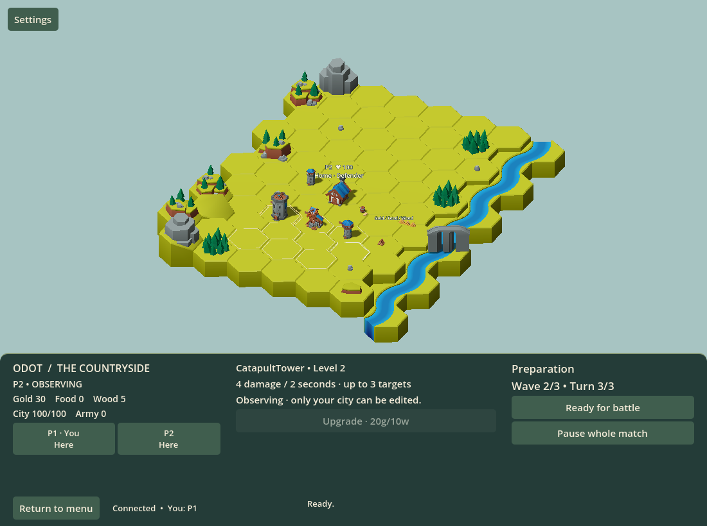
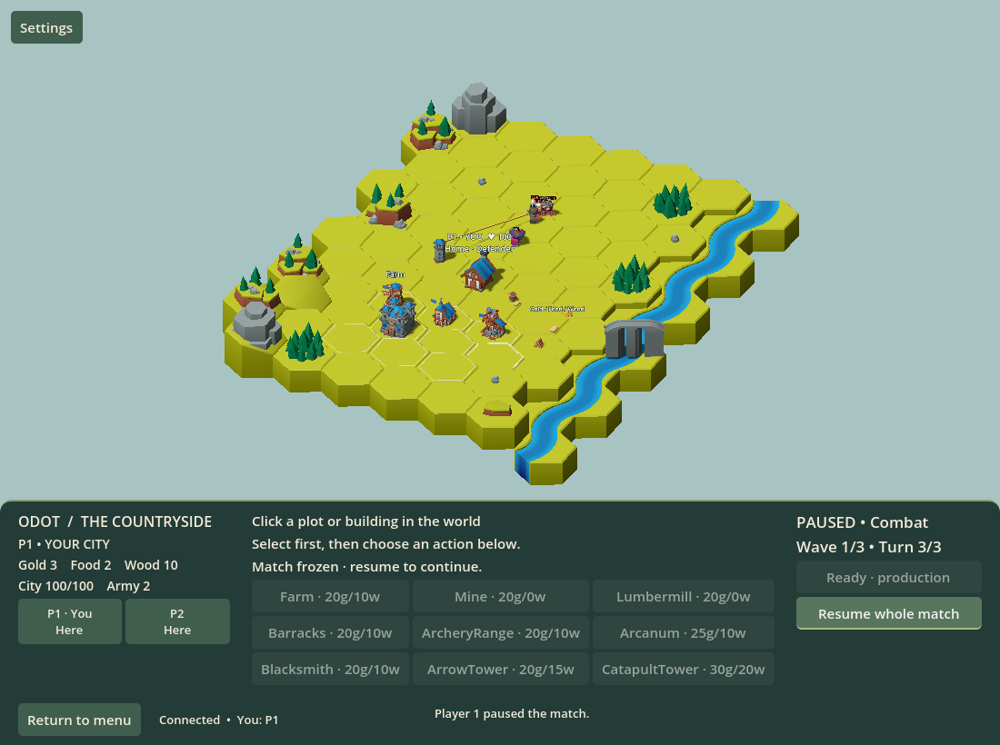
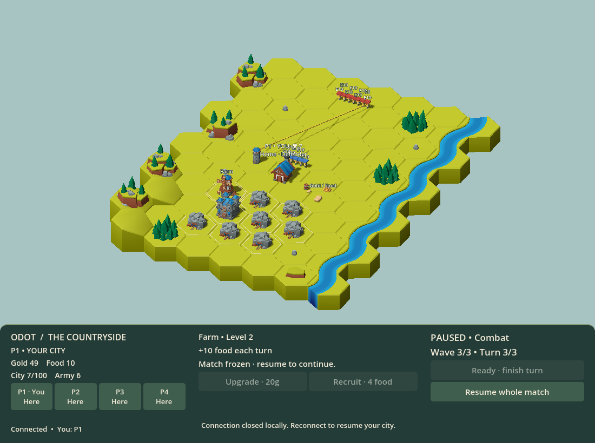

# The Common Watch: gameplay

See the [product introduction](../README.md) for the cooperative settlement-defense premise and [stable technical identity](../README.md#stable-technical-identity) for rebrand compatibility.

One to four players share a match, each owning five initially open plots among nine indexed building slots displayed as three staggered rows of hex plots and a separate grassy battle approach. Single player starts one city immediately; hosted multiplayer waits for the original host to click Start. Join the roster before start. The roster is fixed after start; returning players can resume, fresh players cannot join. Return to menu and start again for a fresh local/hosted match; restart a dedicated server for another match.

Each city starts with 100 health, 12 gold, 6 wood and zero food, stone, metal and cloth. Every living city, including an absent player's city, receives 2 base gold plus its producers' outputs at each of the three production turns. Producers consume no inputs. All costs and outputs use bounded whole-resource amounts; payment and production overflow reject the complete operation without partial spending or income.

These are the current defaults, exercised by the finite twenty-wave strategy sample below. `G/W/S/M` mean gold/wood/stone/metal; omitted components are zero.

| Building | Construction | Maximum level | Level 1 / 2 output or role |
| --- | --- | ---: | --- |
| Lumbermill | 1 W | 2 | 1 / 2 wood |
| Farm | 2 W | 2 | 5 / 8 food |
| Gold Mine (existing Mine identity) | 2 W | 2 | 1 / 2 gold |
| Stonecutter | 2 W | 2 | 1 / 2 stone |
| Metal Mine | 2 W | 2 | 4 / 8 metal |
| Weaver | 2 W | 2 | 4 / 8 cloth |
| Barracks | 2 W | 5 | Swordsman and Berserker |
| Archery Range | 2 W | 5 | Crossbowman |
| Arcanum | 5 G + 2 W + 3 S | 5 | Mage |
| Research Tower | 2 W + 2 S | 2 | +1 / +2 research per three-production cycle |
| Arrow Tower | 4 G + 3 W | 2 | 5 / 7 damage per shot |
| Catapult Tower | 6 G + 4 W + 3 S + 2 M | 2 | 6 / 8 damage per shot, at most three victims |
| Market | 2 W + 2 S | 1 | Explicit fixed-bundle sales |
| Town hall | 5 G + 2 W + 2 S | Independent tracks | 6 stored size / 5% maximum-HP recovery per paid production |

Producer upgrades cost 2 W + 2 S. Research Tower and Arrow Tower upgrades cost 4 G + 2 W + 2 S; Catapult upgrades add 1 M. Barracks and Archery Range first upgrades cost 2 W; Arcanum's first upgrade costs 4 G + 2 W. Later recruitment upgrades cost respectively 6 G + 2 W + 2 S, 9 G + 2 W + 3 S and 14 G + 2 W + 4 S. Market has no upgrade. Quotes and output come from the authority's frozen catalog; custom Rules values are already in these units.

Basic producers, Barracks and Archery Range spend wood. Stock is the prerequisite even after its producer is sold. Arcanum needs stone to construct; Mages need cloth to recruit. Normal Lumbermills cost 1 wood. At exactly zero wood, an eligible owner can explicitly buy a recovery Lumbermill for 4 gold on an empty purchased plot. Normal requests never substitute currency. Recovery pays and records that actual quote, so its sale refunds 2 gold; an unupgraded normal Lumbermill refunds zero. Stone enables upgrades and advanced branches; metal and cloth fund ongoing equipment, while food pays battle upkeep.

The nine plot IDs stay stable. IDs 0–4 start purchased and IDs 5–8 remain selectable while locked. Purchase any locked plot for 5, 8, 12 then 18 gold, according to the number of expansions already purchased. These prices are balance candidates. Purchase requires no Market and remains permanent after selling its building. A stale expansion price is rejected; a full five-building city can buy more land without removing a building first.

Building sales also require no Market. The refund is half the actual paid construction and upgrade investment, rounded down independently after summing each resource. For example, 5 wood + 2 stone invested returns 2 wood + 1 stone. Plot purchases, recruitment and research spending are excluded. Sale removes production, recruitment access, research production or tower behavior, but retains existing soldiers, wounds, points, progress and technologies. Rebuilding creates a new level-one instance with fresh investment, gives no free soldier, and does not revive an old tower action. Requests aimed at the sold instance are rejected even if the same building type replaces it.

A currently owned Market enables explicit one-way sales: five wood or stone returns one gold; five metal or cloth returns two gold; 25 food returns one gold. Sell a positive whole bundle count. No imports, automatic sales or rate stacking from additional Markets exist. Selling the last Market removes stock-trade access immediately. The food-sale preview shows the resulting payment and exact sit-out count before acceptance. Selling food reduces the food available for the forthcoming upkeep calculation at the battle boundary. Stock deduction and proceeds are atomic, including overflow rejection.

Click an outlined plot or a building roof to select its stable slot, then choose an action in the bottom panel. Clicking only selects. Recruitment appears only at the matching building. Open Research without selecting a plot to inspect or buy technologies; viewing another city shows a read-only tree. City tabs clear selection and permit inspection of other players' cities. Ready prevents editing; Unready restores it until all connected living players are ready. A ready check grants production once and clears readiness. After production three, **Preparation** allows construction, upgrades, research and recruitment using that income. **Ready for battle** then starts combat without granting more resources. Twenty waves have exactly sixty productions and twenty preparation checks. The phase and stage serial guard reject delayed commands, including old ready commands.

The top-right text table shows **Resource**, **Stock** and **Income/turn**, in Gold/Food/Wood/Stone/Metal/Cloth order. Income is synchronized base gold plus current producer output; it changes after construction, upgrade or sale without paying production. Positive income uses `+`, zero uses `0`; custom overflow is `Unavailable`. In Preparation/Combat the heading is **Next building turn**: Ready for battle grants no income. Fallen and terminal cities have zero future income. Paused/stale labels retain synchronized values; reconnect and city switching refresh from the authority.

The small **Upkeep** table directly underneath shows **Next battle** food demand and **Food after payment**, or the exact number of soldiers that **will sit out**. Six Swordsmen with 15 food show demand 6 and balance 9. A shortage alone does not disable Ready. Details retains the projected payment and stronger-first allocation. Combat shows **Paid this battle · WN** and the actual payment/reserve count; outcomes show **Last battle · WN**. Fresh sessions clear old receipts. Both tables block world click, zoom and drag initiation. Producer controls show complete cost and output per turn; upgrades show current → next output, and disabled quotes explain **Need N more resource** with its producer source.

Enemy pressure uses an authored twenty-wave catalog per original player. Entries expand in their listed order with the stated level and rank zero. `S/B/C/M` mean Swordsman/Berserker/Crossbowman/Mage; `3 S2` means three level-two Swordsmen. These ordinary compositions remain candidates for the balance gate.

| Wave | Per-original-player entries |
| --- | --- |
| 1 | 4 S1 |
| 2 | 3 S1, 1 B1 |
| 3 | 3 S1, 2 C1 |
| 4 | 3 S1, 1 B1, 1 C1, 1 M1 |
| 5 | 3 S2, 1 C1 |
| 6 | 3 S2, 1 B2, 1 C1 |
| 7 | 3 S2, 2 C2, 1 M1 |
| 8 | 3 S2, 2 B2, 2 C2, 1 M2 |
| 9 | 3 S3, 1 B2, 1 C2, 1 M2 |
| 10 | 1 S3 boss |
| 11 | 3 S3, 2 C2 |
| 12 | 3 S3, 1 B3, 2 C3 |
| 13 | 3 S3, 2 C3, 1 M3 |
| 14 | 3 S3, 2 B3, 2 C3, 1 M3 |
| 15 | 3 S4, 1 C3, 1 M3 |
| 16 | 3 S4, 1 B4, 2 C4 |
| 17 | 3 S4, 2 C4, 1 M4 |
| 18 | 3 S4, 2 B4, 2 C4, 1 M4 |
| 19 | 3 S5, 1 B4, 2 C4, 1 M4 |
| 20 | 1 S5 boss |

The built-in defender remains a separate city-wide two-damage shot every second outside the nine plots. Unit and tower impacts share one simultaneous damage accumulator. Survivors retain identity, level and remaining health between waves; cities retain damage too. A normal shared clear awards each surviving city two gold, five food and one wood; boss clears double those values. Disconnected survivors receive rewards, fallen cities do not. Local clear gives nothing while other living or queued enemies remain. The final doubled reward is included in victory, without another production, upkeep payment or twenty-first wave. Total gross rewards are 44 gold, 110 food and 22 wood for a city surviving every default clear; net balances also include spending, upkeep and production. Rewards never supply stone, metal or cloth.

Before battle, the authority also checks that the eventual reward can fit bounded stocks after upkeep. Overflow rejects readiness without payment or phase change; spend stocks before retrying. Rewards use one guarded shared transition after defeat precedence, so retries, reconnect and corpse cleanup cannot pay twice.

A city falls at zero health. Its remaining attackers immediately move to the entrances of surviving cities' lanes, retaining identity, health and attack cooldown. They are split evenly, with remainders assigned in player-ID order; a previously cleared city can receive them. If two cities fall in the same step, neither receives transfers. Disconnected living cities still count as survivors. Future waves include one baseline allocation per original player, with fallen players' allocations divided among survivors. For example, after one of three cities falls, wave two gives each survivor 6 enemies (12 total). Inheriting enemies does not multiply future allocations. Eliminated players can observe, pause and resume. All players share victory after wave twenty if a city survives; all cities falling ends the match in defeat, including simultaneous final enemy deaths.

The ordinary first defense starts Farm, Metal Mine and Barracks, earns three productions and equips six Swordsmen while retaining 15 food. Battle pays six food once. A Catapult opening starts Stonecutter, Metal Mine and Lumbermill and waits for three productions before constructing the tower in Preparation. Complete frontline, mixed, tower and research families pass the finite campaign sample described below; no-investment play loses through city damage.

Any connected roster member can pause or resume the whole match. Pause freezes movement, attack cooldowns, health, production and turn progression. It also rejects economy/readiness commands. Networking stays active, and absent players can reconnect. Disconnecting itself never pauses or deletes a city: production/combat continue, readiness clears, and disconnected players do not block the ready check. With no connected living players, building waits; combat keeps running unless paused.

Walls, general field/city healing, save recovery, host migration, server restart recovery and matchmaking remain outside this change. Town hall recovery is the bounded stored-unit exception described below. Land expansion, building sales and explicit Market trades use the same authoritative economy command path. Battle upkeep is charged once when preparation actually becomes combat, after prior deaths release their space. Rules and typed catalogs are centralized in `src/Game.Core`; the server sends costs/output values in snapshots so the UI uses the actual rules.

The bottom panel keeps city resources/health/army and inspection tabs on the left, selected building details/costs in the middle, and match controls on the right. Start is available to the original playing host in a hosted lobby (or connected players on a dedicated server); Ready/Unready and Pause/Resume follow the authoritative phase. Connection and rejection messages appear along the bottom. A disconnected window offers Reconnect to my city; a synchronized resume retains the city and starts with no selected plot. Expired credentials expose the fresh-session lobby action. Fallen players can inspect all cities and pause/resume; victory/defeat remains visible to the entire roster.

## Music and local settings

Press **Esc** or click **Settings** in the top-left to open Graphics and Audio.
Press Esc again or **Close** to return; Esc dismisses an open dropdown first.
Opening settings blocks gameplay input in your window while the shared match and
network updates continue. Use **Pause whole match** separately to pause everyone.
One application music player continues across menu, solo/hosted sessions, connecting, pauses/outcomes and reconnects.

Graphics offers **Windowed** and **Fullscreen**. Windowed resolution changes the
window's size, with 1100×820, 1280×720, 1600×900, and 1920×1080 offered when they
fit your monitor's usable area. Fullscreen uses the current monitor's native size;
the windowed selector is disabled until you return to Windowed, restoring your
previous size. Manual resizing is shown as a custom size. Saved sizes that no
longer fit fall back to a usable size. Explicit engine launch arguments such as
`--resolution`, `--fullscreen`, and `--windowed` take precedence for that launch;
those overrides do not become saved preferences until you edit display settings.

Audio provides a live **Master volume** slider from **0–100**. Zero mutes all
audio; raising it restores music at its ongoing position. First-launch defaults
are Windowed 1100×820 and Master 50, with the music itself mixed at -12 dB.
The bundled Echoes of Valhalla track plays its intro once and repeats its authored
loop through Godot's WAV playback.

Preferences are stored separately from multiplayer credentials in
`user://settings.cfg` (on a standard Linux desktop,
`~/.local/share/godot/app_userdata/Odot - Nine Tiles/settings.cfg`). Display
selections, completed slider edits, menu closing, and pending changes on orderly
exit save them. Restart restores valid values; reconnect retains the current
ones. Invalid/missing fields use defaults. A failed save displays a message in
the menu while your current settings keep working.

Two running local clients keep independent live preferences. The last successful
save becomes the shared OS user's defaults for later launches; it never updates
the other running window. Servers and headless clients ignore graphical settings
and do not create music players. Music provenance and import details are recorded
in [the asset README](../src/Game/Assets/Music/README.md).

## Start screen and session lifetime

A normal graphical launch opens **Single player**, **Multiplayer**, **Settings**
and **Exit Game**, over static bundled medieval scenery. Keyboard arrows/Tab and
Enter work alongside pointer input. The menu creates no match or gameplay socket.
The bottom of the start screen and Multiplayer view shows your Steam display
name, or **Open Steam to log in** when Steam is unavailable or offline. Host game
checks the current login each time and warns you to open Steam and log in before
creating a lobby.

Single player binds one local city and uses the same validated actions and rules
as multiplayer. Multiplayer offers **Host game** and **Back**. With Steam running
and signed in, Host game creates a private invitation-only lobby; use **Invite
friends** in the bottom panel. Steam’s overlay must be enabled; Shift+Tab
checks whether it can open. If it is unavailable or an invitation dialog does
not activate, the bottom panel explains the problem. Only the original host
starts the match. Missing
Steam/login/access reports recoverable feedback; solo, settings, Back and Exit
remain available. The local `mise run dev` host/guest flow uses ENet independently.

**Return to menu** ends unsaved solo/host gameplay and clears selection and
pending actions; preferences and music persist. Guests keep private credentials
for the same running host. An invitation during a match asks before leaving;
declining preserves it. Returning players can resume after the roster locks,
including pause or elimination, using their retained credential and Steam account.
Fresh players cannot join after start. A new host session has a new match and
refuses old credentials.

The original host owns the whole hosted session. Its orderly leave ends the
session for guests; unexpected loss disables guest actions and offers bounded
reconnect/return feedback. A Steam lobby owner change never migrates gameplay.
**Exit Game** and the window's native close control stop the session, music,
network/Steam resources and the game process. Closing settings restores valid
focus and changes neither readiness nor shared pause.

## Deterministic hex combat

Each authoritative `Match` owns one private Arch 2.1.0 world. A single immutable
`CombatUnit` component owns identity, health, location/lifecycle, decision state
and a closed waiting/moving/windup/recovery action. The action owns its timing,
sequence and explicit unit/city target once. Attack ordinals remain separate
from movement sequences for animation identity. Serialized timing/target fields,
city armies and reservation indexes are projections of that authority. IDs are
stable and never reused. All session modes use the same synchronous 60 Hz rules;
guests render complete snapshots. Engine animation never applies damage.

The default board has 21 cells, three columns over terrain rows -5 through 1,
independent of the nine building plots in rows 2 through 4. Each hex contains
a size budget of six. Every ordinary archetype has size two; a boss has size
six. Integer sizes one through six are supported by configuration, with no
current size-one roster entry. Any same-team mix totaling at most six fits:
three normals, size two plus four, or configured sizes one plus two plus three.
Six distinct fixed render anchors carry no shape or capacity costs. Opposing
factions cannot share occupied or reserved cells.
Range uses shortest-path distance on the authored axial graph, never model
geometry. A separate city distance anchor links the neutral home frontier and
provides no movement shortcut. Board scale and anchors passed the early rendered gate. Neighboring rendered centers are approximately
three world units apart; render anchors use integer thousandths of a world
unit for presentation only. Melee deliberately uses tabletop presentation:
rigged swings at fixed anchors, restrained dashed ground-space windup intent
and a pointer to the locked target, then a short local sword/axe accent and an
authoritative landed target flash or grey miss cue. It draws no opaque spanning
sword beam. It does not manufacture physical
weapon contact or move an attacking model between anchors.

Each side's rear row is permanently protected against opposing placement and
transit, but occupants remain normally attackable. Enemy and isolated non-roster
setup allocates rear support first, then forward melee, activates together and
queues overflow. City-roster allies instead start at their persistent purchased
homes, independent of class; this budget does not restrict later movement. Within each
tier use initiative and seeded ties; choose the least used compatible cell,
then center/owner-relative left/right, then its forwardmost free render anchor.
Combat admission tries forward capacity then protected rear for melee; support
uses rear capacity. Scan the persistent tier/initiative/seed order past actors
that do not currently fit, admitting a smaller actor without rerolling a blocked
boss. Free size in different cells cannot be pooled. No permanent lanes or free intra-hex rearrangement exist.
Reinforcements transferred into a cleared city can enter protected rear cells
while defenders hold its neutral forward band. If retained enemy deaths block
entry, cumulative whole-actor size releases in each protected cell determine
the fixed first-admission bound: the first existing release tick at which any
queued actor fits one cell. Retries cannot slide this deadline. A size-six boss
needs a whole free cell and the same legal route to engagement.
Further overflow still queues normally. A conserved queue without ensuing
engagement does not establish progression.

| Archetype | Health | Damage | Equipment | Food per battle | Size | Initiative | Hex range | Move ticks | Windup / recovery | Death ticks |
| --- | ---: | ---: | --- | ---: | ---: | ---: | ---: | ---: | ---: | ---: |
| Swordsman | 40 | 10 | 2 metal | 1 | 2 | 10 | 1 | 30 | 12 / 48 | 48 |
| Berserker | 30 | 15 | 3 metal | 2 | 2 | 20 | 1 | 27 | 18 / 54 | 48 |
| Crossbowman | 30 | 10 | 1 metal + 2 wood | 1 | 2 | 30 | 3 | 30 | 18 / 42 | 48 |
| Mage | 25 | 12 | 3 cloth + 1 gold | 2 | 2 | 40 | 3 | 30 | 24 / 66 | 48 |

These are the current level-one base values. Equal faction profiles use equal levels, authored enemy rank modifiers and explicit capabilities. Player foundations add 5% to maximum HP and direct damage without healing. Specialization mastery replaces its earlier effect. Health/damage use checked integer hundredths, retaining fractional effects.
New recruits capture their building's level, one through five. Existing veterans retain their level and wounds when a building upgrades, is sold or rebuilt. Stats use `round(base * 1.35^(level - 1))` to whole points with midpoint ties upward, then apply boss multipliers, then research. Swordsman HP by level is 40/54/73/98/133 and damage 10/14/18/25/33. Bosses have size six, eight times leveled HP and twice leveled damage: level three 584 HP/36 damage and level five 1064 HP/66 damage, before research. Ordinary size stays two at every level. Levels do not change timing, movement, range or initiative.

Equipment prices also scale from the original base by 1.35, rounding each positive component to the nearest whole, midpoint upward. Zero components stay zero, and every default total price increases. Swordsman metal costs are 2/3/4/5/7; Mage cloth 3/4/5/7/10 and gold 1/1/2/2/3. Valid custom small costs may plateau after rounding but never decrease. Recruitment never deducts food and buildings never give free recruits. City snapshots publish all leveled equipment/profile quotes, including purchased research.

Each living owned soldier owes its archetype's food upkeep at actual battle entry, including Town hall storage, soldiers still queued for combat space and disconnected cities' armies. Upkeep does not grow with level. A pure forecast shows total and field/stored demand and which IDs current food can fund. Actual allocation funds field first, then stored; within each group it sorts by descending level, then ascending unit ID. It skips unaffordable units and continues to cheaper ones: with one food, a level-five Mage sits out while a lower-level Swordsman can participate. There is no debt or partial feeding. Setting/withdrawing ready, pause, snapshots, reconnect and waiting for death cleanup do not charge food.

Unfed field units retain their purchased homes but remain wounded inactive reserves for the entire shared wave: no hex claims, queue admission, targets, attacks or city screening. Stored units remain stored whether funded or unfunded; paying their food never deploys them. Fed capacity-queued soldiers remain participants and pay only once. Towers and the built-in defender continue normally if all soldiers sit out. At the next battle all survivors are considered again; only eligible stored production recovery can have changed their wounds. A wave-tagged receipt preserves actual payment, funded IDs and field-participant/unfunded IDs independently of the next forecast. Food sold at a Market reduces the next forecast, and battle rewards become available only after the shared clear.

At a new attack select the closest in-range living deployed opponent, then the
lowest target initiative, then a seeded exact tie. Melee requires distance one.
Ranged units hold when anything is in range. Otherwise one integer BFS per
actor scores all opponents by reachable attack-position steps, target initiative
and a seeded exact tie. If none is reachable, legal static movement distance
ranks blocked objectives. Every eligible action boundary reevaluates all targets;
a retained objective has no priority over a newly shorter approach. Only the
winning target gets a route. Equal shortest support goals prefer a friendly melee
screen, then less used capacity, then a seeded anchor choice. Shortest-path
predecessors reconstruct a simple route without searching for each opponent.

Exact local target and reservation observations invalidate a blocked decision;
unrelated cities and nonlethal health changes preserve its key and scheduling
rank. Temporary transit conflicts are checked at atomic move commit. Unchanged
episodes retain their visited cells to avoid walking back through congestion;
only repairing that winning episode may require one extra BFS. Changing the
objective clears the old exclusions. Unchanged blocked retries preserve choices
and wait for local changes. Rendering frames never trigger numerical decisions.

A move starting at tick 100 and ending at 130 locks its source, destination and
transit conflicts together. Before tick 130 attacks see only the source; at 130
arrival commits before impacts, so attacks see only the destination. No attack
or route change occurs mid-step. Lower actor initiative wins conflicting moves;
seeded ranks resolve equal initiative, while independent actions start together.
Each tick expires retained deaths, completes arrivals and recoveries, resolves
all due impacts against the same pre-damage view, applies checked accumulated
damage, retains new deaths, admits queued arrivals and finally starts actions.
An unsuccessful reservation commit leaves the actor waiting with no partial move.

An attack started at T impacts at T + windup and finishes at T + windup +
recovery. The unit stays anchored through both intervals. All due unit/defense
impacts share one snapshot and damage accumulator before deaths; initiative
cannot cancel a simultaneous lethal exchange. Invalid locked targets cause
misses with normal recovery. Mage splash has radius one hex and cap
two, primary first, then distance/initiative/seeded ties. Catapult radius is
zero with cap three. Friendly, queued and dying units are excluded. City damage
is one primary hit. Defender and towers have independent positive windup/recovery,
using the shared city distance anchor regardless of plot. Candidate defender
damage is 2 per second; Arrow levels deal 5/7 per second and Catapult 6/8 per two
seconds. These values are tuned separately from unit approach speed.
Defender and tower identities are explicit. Every defense receives a complete
frozen damage/windup/recovery/victim-cap/radius profile and uses the same pure
attack-deadline and victim-selection rules as units. The default defender remains
single-target (cap one, radius zero); configured splash applies to its actual
impact rather than only its fingerprint.

Death immediately removes a unit from living counts, actions and targeting, but
retains its full size claim until death end. A committed move atomically holds
its full size at source and destination, counting each actor once per endpoint;
only the source is attackable before arrival. Rejected moves hold no partial
claims. Arrival releases source/transit while retaining destination. A transit
death freezes route progress and
retains both endpoint and transit locks. Death at tick 200 with duration 48
releases space at tick 248. Wave completion is immediate; bounded cleanup can
continue outside combat, and a ready next-wave preparation waits for that cleanup
without extra income. Pause freezes the authority's action/death clock.
Unexpired bodies remain in the separate current dying collection at their
original battlefield during reinforcement transfer; they never transfer as
living attackers. Expiry removes the body and all of its reservations together.
Ending or replacing a session disposes those retained locks and events rather
than carrying them into a fresh battlefield.

A fight retains a non-secret 64-bit seed and immutable configuration fingerprint.
Combat rules version is four; the decision mixer stays at algorithm version one.
The size-budget rules and explicit boss size are fingerprinted. Protocol v10
carries size claims and render-anchor identity and refuses old peers. The same canonical setup, seed, rules/algorithm version and ordered accepted
commands reproduce the same normalized trace. Version-one SplitMix decision
keys separate targeting, movement ranks, route/goal, formation and splash choices.
Credentials, session GUIDs and cosmetic randomness are separate. Core strategy
acceptance samples seeds 0, 1 and 123; this finite sample is not universal balance
or deadlock proof. Paired role tests demonstrate effective splash contribution, frontline protection
and queued melee access; see the measured comparisons in `docs/verification.md`.

The default no-health-progress allowance is 3,600 ticks per active city and the
wave duration bound is 18,000 combat ticks. Only actual health reduction resets
progress; walking, misses and admissions cannot extend it. Normal completion and
all-cities-fallen defeat take precedence. An unresolved limit ends the match as
`BattleStalled` defeat with unchanged surviving health. Numerical lifecycle, limit and early rendered checks pass. Final full integration acceptance passes; see `docs/verification.md` for evidence.

Knight, Barbarian, Rogue and Mage and the four corresponding free Skeleton rigs use imported skeletons and role weapons at `handslot.r`. Committed visual steps interpolate straight between their declared anchors on the common snapshot clock, using walking instead of sprinting. Transient visual crossings of other moving, standing or dying models are intentional; settled models remain at distinct anchors. None of these crossings changes numerical capacity, source attackability, reservations, route choice or arrival timing. Programmatic AnimationTrees sample bounded idle/walk, attack and filtered hit blends, with immediate terminal death precedence. Facing follows the shortest angle using combat-clock advancement and freezes with positions/poses on pause or transport loss. Admission reconstructs the current direction rather than playing a historical turn. These are smoother presentation transitions, not slow motion: every ordinary 60 Hz numerical tick, concurrent action deadline and outcome remains unchanged. Sword uses horizontal slice, Berserker two-handed chop, Crossbowman ranged shot and Mage Spellcast_Shoot. Horizontal root motion is suppressed. Sword strike is 0.40 clip seconds, crossbow release 0.43, axe descent 23/30 (0.767) and cast extension 8/30 (0.267), mapped onto authoritative impact and recovery. Cosmetic effects never apply damage. The hex presentation migration aligns death clips and retained bodies to authoritative death intervals, including cleanup outside combat and reconnect. See the [final presentation gate](verification.md#final-synchronized-presentation-gate-passed) for completed source/package checks and coverage limitations.

Terraces, riverbank, bridge, mountain edges, flags, grain/racks/scaffolding and structural tower bases provide village detail. Raised surfaces, building bounds and selection rings use per-plot heights. The combat approach stays flat. Level two adds distinct structures/props instead of enlarging the whole building. The windmill rotates its separate authored fan node; flags use restrained procedural motion on the same presentation clock.

Gold bars, food sacks and free wood logs represent stocks with bounded instance tiers: zero → 0, 1–19 → 1, 20–49 → 3, 50+ → 6 per resource. HUD amounts remain exact. Switching cities and reconnecting reconstruct current stocks without replaying earnings.

Accepted local construction/recruitment/research commands cue once by match and sequence; retries and rejections do not repeat success puffs. Battle sparks, projectiles and skeleton rattles use the buffered event cursor. Focus changes/reconnect/gaps discard historical effects. Effects cap at 64 and audio at eight voices, dropping cosmetic overload only. All cues route through Master; pause/loss stop voices, and session teardown removes them while the application music continues. Original sounds use 22,050 Hz mono signed 16-bit PCM, 0.12-second cubic decay, sine frequencies 110/220/330/440/660/880 Hz and fixed-seed noise transients. Village ambience is a restrained synthesized cue every 12 unpaused seconds. Silent Dummy-audio verification checks lifecycle/routing/mute state, not listening quality. Headless roles instantiate none of this presentation.

A shared, bounded snapshot clock interpolates all bodies with the same fraction,
without extrapolating beyond authority. A 120-tick, at-most-4096-record event
history carries final casualty states. Initial admission, reconnect and detected
history gaps baseline the event cursor at the current high-water mark: current
living poses and unexpired dying bodies are reconstructed from complete state,
without historical effects. Overlapping snapshots deduplicate effects;
revision and match guards reject stale state. A fresh session clears all live/dead
views, pose buffers and cursors.

New entry visuals wait for their deployment snapshot’s common clock before appearing, preserving separation from interpolated neighbors. Surviving city-roster units retain their exact assignments and return to those homes only after all retained death claims release, including final victory. Stored units have no battlefield model or combat claim.

The 32-vs-32 numerical fixtures verify legal occupancy every step, finite progress and identical serialized results with reversed entity storage, including all four friendly roles against mixed skeleton melee. Ordinary strategy fixtures retain the real defender and default resources and record resources, recruits/casualties, city HP and bounded battle duration.

Economy balance evidence uses the shared ordinary-command policy in `tools/DevRunner/CampaignStrategy.cs`: four solo families and frontline co-op with two, three and four players, each at seeds 0, 1 and 123 (21 complete campaigns). All reached wave-twenty Victory with all original cities alive, 60 real productions and paid battle upkeep. Initial stone/metal/cloth were zero. Final equipment outputs are Metal Mine/Weaver 4/8 per turn; gold/material defaults are rebased, food and combat values remain unchanged. Earlier trials exposed insufficient replacements and late Market construction; the final policies retain more troops and establish Markets earlier.

The policy builds Farm/Metal Mine/Barracks/Lumbermill/Stonecutter on the first five plots, recruits six paid Swordsmen for the first battle, then upgrades producers and the Barracks and purchases actual locked plots and army homes. At the eighteen-unit field ceiling it can explicitly retire lower-tier veterans for paid replacements; retirement is not a casualty. Mixed adds Weaver/Arcanum/Archery Range; towers adds Arrow/Catapult defenses; research adds Research Tower and the melee foundation/Guardian/Guardian mastery path. All retain recurring equipment supply and use quoted Market bundles. After wave thirteen, with at least 24 stone stock and level-five Barracks, they sell the upgraded Stonecutter for its actual half refund and build a Gold Mine on the retained plot. Land, troops and research remain. Recruitment logs verify no food deduction, material charges, later metal/cloth recruits, full-land expansion, producer upgrades, trades and reconfiguration.

A producer upgrade adds one level-one output while saving a plot and gold compared with purchasing another plot and producer, but requires stone. At current rates, two turns of a level-one Metal Mine produce eight metal: selling five returns two gold and retains three metal, versus two gold from a level-one Gold Mine over the same turns; this consumes equipment stock and requires an additional paid Market. Markets and Gold Mines therefore have different land and supply costs. The receipt/action logs record stocks before/after commands, investment, individual army levels/health, forecast/actual rations, casualties, rewards, city health and per-wave ticks.

This finite sample establishes viable ordinary strategies; it is not universal balance proof. The current cleared-frontage reinforcement witness uses seed 109 with ordinarily produced stone and a paid L3 receiving-city Barracks, retaining the cleared/occupied-forward-band and inherited-allocation assertions. Earlier seeds 1/2/8/90 are historical input-specific evidence, not promises for persistent-home formation. The Mage/Crossbowman role witness uses six ordinary screen units against six ordinary enemies at seed 123, identical identities and the shared live interval. Mage equipment is 3 cloth/1 gold and upkeep two; Crossbow equipment is one metal/two wood and upkeep one. Both clear normally; effective support damage is 6400 versus 4000 hundredths, clearance 253 versus 283 ticks, and surviving army HP 17500 versus 16000 hundredths. No inflated enemy HP, seeded clustering or altered default profiles are used.

## Purchased army homes and Town hall rotation

Each city starts with **two physical homes**, each holding six size points: **six ordinary size-two units**, not twelve units. Buy the four further homes for **5/8/12/18 gold**, independent of building land or Town hall upgrades. Six homes give 36 size points, normally eighteen field units. The order is forward center/owner-left/owner-right, then the rear row in that order; each insertion uses the first fitting purchased tile and its forwardmost free anchor, then anchor ID. Free size in different tiles cannot be pooled. Existing assignments never repack automatically. All ordinary roles use this same insertion policy; enemies retain automatic class-based formation.

Recruitment pays the current equipment quote only if one home fits. Survivors keep identity, unit level, wounds and assignment. Death frees roster size but retained combat corpses still block spatial restoration until cleanup. Click an owned field unit for **Retire** (permanent, no refund or death animation) or select a destination **Town hall** and **Store**. Transfers preserve identity, level, wounds and capabilities and are atomic: full/foreign/stale destinations reject without spending or losing the source unit. Send from a selected hall roster entry uses field first-fit, never overflow. Selection itself changes nothing. Controls are available only to the connected owner during unpaused, unready Building or Preparation; paused/disconnected inspection is read-only.

A Town hall occupies one purchased building plot. Its two independently quoted tracks are:

| Track | Level 1 / 2 / 3 | Upgrade to level 2 | Upgrade to level 3 |
| --- | --- | --- | --- |
| Storage | 6 / 12 / 18 size points (3 / 6 / 9 ordinary units) | 8 G + 2 W + 2 S | 12 G + 2 W + 3 S |
| Healing | 5 / 10 / 15% current maximum HP per actual production | 6 G + 2 W + 2 S | 12 G + 2 W + 3 S |

Storage uses separate six-size reserve tiles, not one pooled free-size total. Several halls each own their generation-specific inventory. Neither track purchases battlefield homes. Occupied-hall sale rejects; empty sale includes actual construction and both tracks' investments in the existing component-wise half refund. These tracks do not upgrade individual unit levels.

Recovery requires that the **same living ID's food was funded in the most recently completed shared battle**. Field-funded survivors can rotate into storage with that eligibility. First-cycle storage and newly recruited IDs have no completed paid receipt; merely storing them grants no healing. Unfunded stored units cannot recover until funded through a subsequent completed battle. At each real production, heal only currently stored eligible units by `ceil(current maximum integer HP × percent / 100)`, capped at maximum; integer HP uses hundredths. A 40-HP unit at 5% gains 2 HP per production, at most 6 HP over the three-production cycle. Changed research maximums affect the calculation, not eligibility and never retroactively heal wounds.

Health, resources and research preflight together before production commits. Ready/unready toggles, Preparation, upgrades, transfers, selection, pause, reconnect, retries and elapsed wall time cannot create another heal. Completed funding is separate from the current in-progress battle's payment receipt. Food-starved storage creates no damage, debt or automatic eviction.

The paid `ArmyBalanceTests` comparison covers seeds 0/1/123, frontline versus reserve rotation and the selected **5/8/12/18** versus **5/8/16/24** control. Both curves support those twelve finite main campaigns. Reserve investment meaningfully reduces replacements while delaying field expansion; it is not compulsory to win. Initial-home-only and no-tier controls still lose. See [verification evidence](verification.md#army-homes-and-town-hall-2026-10-03) for per-wave costs, casualties, recovery and limitations. No enemy, AoE, boss, food-rate or release-version rebalance accompanies these choices.

## Personal research and temporary statuses

Research resets each match and remains personal across its twenty waves and reconnects. Everyone starts at zero and surviving cities, including disconnected owners, receive **one point per shared clear**, including bosses and final victory. No local-clear payment or boss research multiplier exists. Receipts identify the actual awarded point and wave; retries do not pay again. Defeat pays no clear reward.

Research Towers replace the Blacksmith at building identity 7. Construction costs 2 wood and 2 stone; upgrading costs 4 gold, 2 wood and 2 stone. Each actual production adds **one/two progress units** per tower; every three units become one point and the city retains remainder 0–2. Thus a full cycle earns **+1/+2 points**, with multiple towers additive. Building or upgrading between productions grants no catch-up. Selling retains points, partial progress, technologies and purchase access. Towers occupy plots and have no combat actor or attack. Research is separate from the six Market resources.

| Foundation (3 points) | Exclusive choice (6) | Mastery (9) | Effect, replaced at mastery |
| --- | --- | --- | --- |
| `melee-foundation` | `guardian` | `guardian-mastery` | Incoming direct/periodic damage reduction 10% / 20% |
| `melee-foundation` | `assault` | `assault-mastery` | Direct damage +10% / +20% |
| `ranged-foundation` | `venom` | `venom-mastery` | Poison potency 10% / 15% of captured direct damage |
| `ranged-foundation` | `precision` | `precision-mastery` | Direct damage +10% / +20% |
| `magic-foundation` | `fire` | `fire-mastery` | Burn potency 20% / 30% of captured direct damage |
| `magic-foundation` | `frost` | `frost-mastery` | Future action duration +20% / +40% |

Every foundation adds 5% maximum health and direct damage to its class. A complete chosen path costs 18 points. Specializations permanently lock their sibling and its mastery; classes remain independently combinable. Existing wounded veterans retain identity, health and level; future recruits receive the same technologies. Defenses and transferred enemies never inherit city technologies. Foundations scale level/boss stats first, followed by direct-damage bonuses. Guardian applies to each incoming contribution once, rounding the positive remainder upward.

Open **Research**, then select Melee, Ranged or Magic. The scrolling tree shows balance, progress, effects, prices, prerequisites and permanent locks. Purchase descriptions identify the sibling lock; there is no confirmation dialog. Global purchases are available to an authenticated living owner in unpaused Building/Preparation while unready, independently of plot selection and tower ownership. Foreign inspection is read-only. The panel blocks world input without pausing the shared match. Commands use `research-tech <technology-id>`; the legacy rank command is rejected. Protocol version 10 is required by ENet and Steam admission.

Only actual landed victims receive statuses, after simultaneous damage and only if they survive. Mage splash retains its authored radius/cap. Zero-damage attacks grant no periodic effect. Potency captures the source's resolved direct damage at application, rounded upward; removing the source does not change it.

- **Burn:** one stream, 60-tick period, 180-tick lifetime. Refresh keeps the greater potency, later expiry and existing next tick.
- **Poison:** at most three independently timed stacks, 60-tick period, 360-tick lifetime. A fourth hit refreshes the earliest expiry, with stable application identity breaking ties; potency increases if stronger and the next tick stays fixed.
- **Chill:** strongest-only duration penalty, 180-tick lifetime, validated maximum 50%. New move, windup and recovery intervals each use `ceil(baseTicks * (100 + penalty) / 100)`. Already committed intervals and reservations remain fixed when chill arrives or expires. Chill expires before action selection at its expiry tick.

The first periodic tick is one full period after application; a tick exactly at expiry damages once before removal. Pending applications sort by victim, kind, source and attack identity. Due periodic and ordinary/defense damage use a common pre-damage state: an attacker killed by poison still delivers its valid due strike, then cannot start another action. Periodic damage never recursively applies statuses. Only actual health reduction resets the engagement deadline.

Transfers preserve potency, stack identities and absolute deadlines. Afflicted queued enemies continue ticking while untargetable and nonspatial, and can die before admission. Death removes active scheduling; retained hit/death events carry periodic contribution evidence. Wave resolution clears surviving effects without healing; cleanup does not deliver later damage. Fresh recruits/reserves start clean. Pause freezes simulation deadlines without wall-clock catch-up.

Inspection shows actual capabilities, poison stacks and strengths, remaining simulated time, and committed impact/ready deadlines. Restrained ▲ Burn, ● Poison and ◆ Chill badges combine shape/text with color, using the shared playback clock. Queued effects appear in enemy allocation details without world bodies. Reconnect/history gaps reconstruct current state without historical flashes or sounds. Freeze, stun, interruption, healing, reactions, economy/defense technologies and account progression remain deferred.
